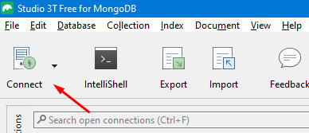
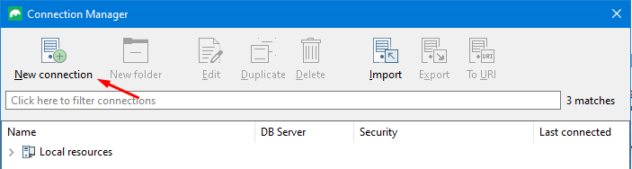
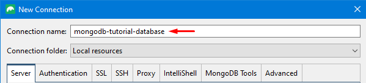
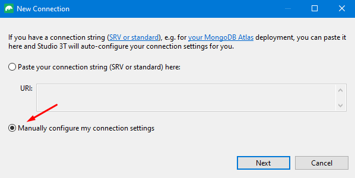
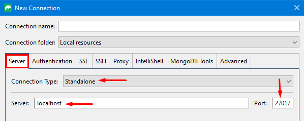
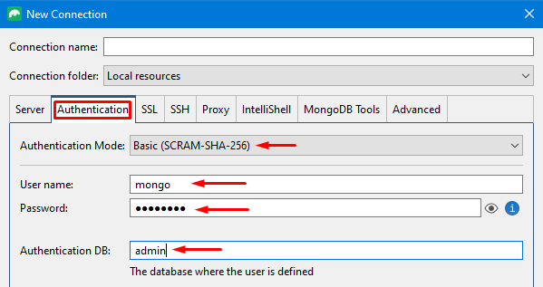
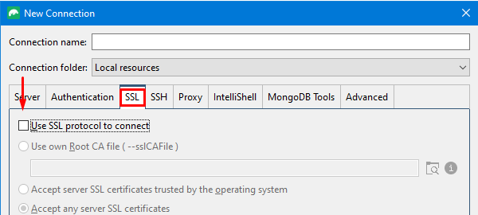
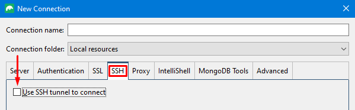
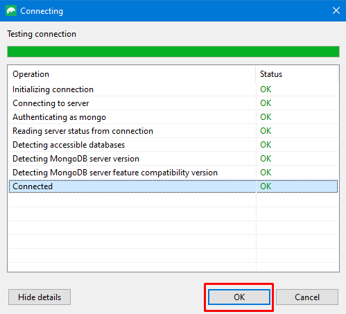
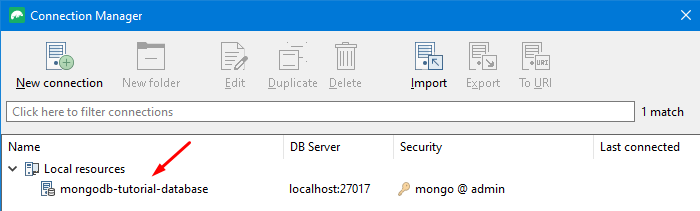

* ├  ─  └  y  │  ──  *


# Tabla de contenidos

1. [Descripción](#descripción)

2. [Arquitectura](#arquitectura)

3. [Requisitios](#requisitos)

4. [Instalación](#instalación)

5. [Conexión](#conexión)

6. [Explicación de Docker Compose](#explicación-de-docker-compose)

7. [Explicación de Scripts de Inicialización](#explicación-de-scripts-de-inicialización)

8. [Explicación de gitignore](#explicación-de-gitignore)

9. [Notas de Instalación](#notas-de-instalación)


# Descripción

Este proyecto permite instalar una base de datos MongoDB en el sistema local utilizando Docker. De manera automática, se ejecutan unos scripts de inicialización que configuran un par de usuarios y sus roles, y tambien cargan algunos datos de prueba para realizar consultas, a lo largo de la documentación se pueden ir entendiendo estos detalles.

Todo el proceso de instalación se configura a través del archivo `docker-compose.yaml` para la automatización de las configuraciones.

Los **Objetivos** principales contemplados en la documentacion del proyecto son:

:heavy_check_mark: Instalar de manera rápida una base de datos MongoDB en el sistema local para propósitos de desarrollo y pruebas, con una configuración muy cercana a una instalación real en un ambiente de producción.

:heavy_check_mark: Gestión básica de Usuarios y Roles en MongoDB

:heavy_check_mark: Cargar datos al inicio de la base de datos automatizando el proceso con scripts (JavaScript).

:heavy_check_mark: Entender las configuraciones aplicadas en el archivo `docker-compose.yaml`.

:heavy_check_mark: Conectarse a la base de datos desde un cliente de administación con interfaz gráfica.

:heavy_check_mark: Consultas básicas en la base de datos.

:heavy_check_mark: Que puedas replicar facilmente estas configuraciones para tu base de datos propia.


# Requisitos

Para la implementación e instalación de la base de datos MongoDB con docker, debe estar instalado y configurado en el sistema local el siguiete software.

:black_small_square: Visual Studio Code - [vscode](https://code.visualstudio.com/)

:black_small_square: Docker - [docker](https://www.docker.com/)

:black_small_square: Git- [git](https://git-scm.com/)

Adicional, algún cliente de administación de base de datos para MongoDB con interfaz gráfica, se listan los más comúnes, en este proyecto se utiliza `Studio 3T` en su versión gratuita.

:black_small_square: Cliente Studio 3T - [Studio 3T](https://studio3t.com/es/)

:black_small_square: Cliente Robo 3T - [Robo 3T](https://robomongo.org/)

:black_small_square: Cliente MongoDB Compass - [MongoDB Compass](https://www.mongodb.com/products/tools/compass)


# Instalación

:warning: **No olvidar**

Antes de realizar la instalación, asegurarse que ya se esta ejecutando Docker.

Seguidamente en el sistema local (su computadora), desde la consola o terminal, ubicarse en algún directorio y descargar el repositorio.

```bash
$ git clone https://github.com/TrulyDigital/mongodb-tutorial-database.git 
```

Ingresar al repositorio desde la consola.

```bash
$ cd mongodb-tutorial-database
```

Abrir el proyecto en el editor de texto de preferencia (aca utilizamos `vscode`).

```bash
$ code .
```

La estructura del proyecto es la siguiente:

```bash
mongodb-tutorial-database/
│
├── init-scripts/
│   ├── A_users.js
│   ├── B_db_default.js
│   └── C_db_cars.js
│
├── volumes/
│   └── .empty
│
├── .gitignore
├── docker-compose.yml
└── README.md
```

:warning: **Importante**

El archivo de configuración e instalación, que se llama `docker-compose.yaml`, hace referencia a una red interna personalizada para contenedores, entonces, para que la instalación funcione correctamente, lo **primero** que se debe hacer es crear esta red por medio de comandos Docker.

Especificamente la sección en el `docker-compose.yaml` donde esta definida la red interna personalizada es la siguiente :eye_speech_bubble:.

```yaml
    networks:
      - development-net

networks:
  development-net:
    external: true
```

Crear la red interna personalizada.

```bash
$ docker network create development-net
```

Ejecutar el archivo de configuración `docker-compose.yaml`.

```bash
$ docker-compose up -d
```

:exclamation: **Observación**

Este proceso puede toma unos minutos dependiendo las capacidades de la computadora local y de la conexión a internet, lo mas demorado es descargar la imágen Docker de MongoDB del repositorio de [dockerhub](https://hub.docker.com/). Todo esto sucede automáticamente.

Al final del proceso, si la red interna personalizada fue creada correctamente y se descargo la imágen Docker de MongoDB, en la consola se deben ver los siguientes mensajes.

```bash
 Container mongodb-tutorial-database  Creating
 Container mongodb-tutorial-database  Created
 Container mongodb-tutorial-database  Starting
 Container mongodb-tutorial-database  Started
```

La ejecución del contenedor se puede verificar con el siguiente comando, y el contenedor aparece con el nombre `mongodb-tutorial-database`.

```bash
$ docker ps
```

### :white_check_mark: **Voilà**

Ya tienes instalada una base de datos de MongoDB lista para pruebas de desarrollo.


# Conexión

:wrench: Al abrir el cliente administrador de base de datos para MongoDB (`Studio 3T`), seleccionar la opción `Connect`.

<p align="center">
  
</p>

:wrench: Selecciona `New connection`.

<p align="center">
  
</p>

:wrench: Establecer el nombre de la conexión.

<p align="center">
  
</p>

:wrench: Seleccionar la opción de configuración manual y dar click en `Next`.

<p align="center">
  
</p>

:wrench: En la pestaña `Server`, verifica o establece la siguiente configuración:

<p align="center">
  
</p>

:wrench: En la pestaña `Authentication` debes ingresar el usuario y contraseña que se definio en el archivo `docker-compose.yaml`.

:exclamation: **Usuario administrador**

En el archivo `docker-compose.yaml` se establecio el usuario y contraseña del usuario administrador, este usuario tiene control total sobre la base de datos, y puede crear otros usuarios, eliminar usuarios, crear base de datos, eliminar base de datos, insertar documentos en cualquier colección de cualquier base de datos y muchas tareas adicionales.

Por ese motivo la casilla `Authentication DB` se debe ingresar la palabra `admin`, haciendo referencia a que la información que estamos diligenciando es del usuario administrador de MongoDB.

<p align="center">
  
</p>

:wrench: En la pestaña `SSL` verificar que **NO** este seleccionada la casilla `Use SSL protocol to connect`. Para nuestra prueba de concepto en el sistema local, no necesitamos esta opción.

<p align="center">
  
</p>

:wrench: De forma similar, en la pestaña `SSH` verifique que **NO** este seleccionada la casilla `User SSH tunnel to connect`.

<p align="center">
  
</p>

:wrench: En la parte inferior de toda la configuración siempre estará disponible el botón `Test Connection` para verificar la configuración de autenticación.

<p align="center">
  
</p>

:wrench: Guardamos las configuraciones con el botón `OK` y con `Save`. Y les debe aparecer la nueva conexión.

<p align="center">
  
</p>


# Notas de Instalación

### **Detener la ejecución de la base de datos**

Con el siguiente comando, Docker detiene la ejecución de la base de datos MongoDB y elimina el contenedor. Aún asi, todas las configuraciones nuevas realizadas como podrían ser la creación de usuarios, creación de bases de datos o los documentos nuevos que se hayan insertado (por ejemplo a través de nuestro cliente `Studio 3T`), se persisten porque en la configuración del archivo `docker-compose.yaml` hemos definido un volumen externo mapeado a nuestro sistema local y **NO** al contenedor.

```bash
$ docker-compose down
```

:bulb: **Observación**

De manera predeterminada `docker-compose` gestiona la creación y elimincación de redes internas a las que se conectan los contenedores en el momento de iniciar o detener la aplicación, a menos que en el archivo `docker-compose.yaml` este específico que nuestros servicios se conectarán a una red externa personalizada o ya existente, como nuestro caso.

### **Red interna de Docker personalizada**

La configuración de la red en el archivo `docker-compose.yaml` esta intencionalmente definida de esta manera, pensando en las mejores prácticas de implementación y en las arquitecturas de software para el despliegue, cuando en un futuro esta base de datos se instale en producción, es mejor controlar directamente la red de Docker a la que pertenece la base de datos de MongoDB y no dejar que Docker gestione esto por nosotros. 

Sin embargo, si se desea que docker sea el que gestione directamente la creación y eliminación de la red, se debe actualizar la siguiente sección del archivo `docker-compose.yaml`, de esto:

```yaml
    networks:
      - development-net

networks:
  development-net:
    external: true
```

A esto:

```yaml
    networks:
      - development-net

networks:
  development-net:
```

Solamente eliminar la líena `external: true`.

### **Listar las redes existentes en Docker**

```bash
$ docker network list
```

### **Eliminar una red en Docker**

```bash
$ docker network rm [NOMBRE_DE_LA_RED]
```

Ejemplo:

```bash
$ docker network rm development-net
```


